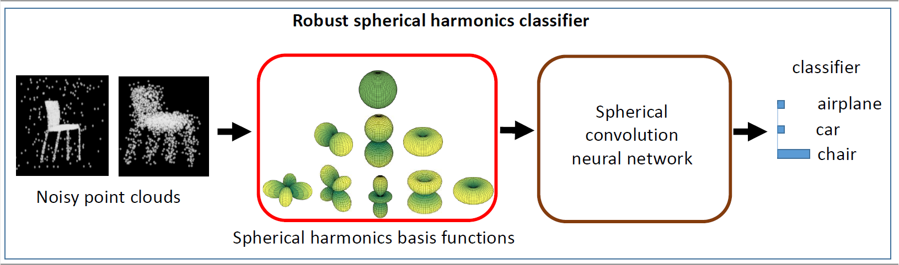

# Robust Object Classification Approachusing Spherical Harmonics
code for the [paper](https://ieeexplore.ieee.org/abstract/document/9713880): Robust Object Classification Approachusing Spherical Harmonics

This repository contains tensorflow implementation of a robust spherical harmonics CNN. The Method was tested for both robust point cloud and image (MNIST) classification. The model uses the voxel grid of concentric spheres to learn features over the unit ball. Also the convolution operations is performed in the Fourier domain. As a result, our model is able to learn features that are less sensitive to Point clouds perturbations and corruptions.





## Training
Our code is based on [
spherical-cnn](https://github.com/daniilidis-group/spherical-cnn). The training and testing files should be stored as .tfrecord. We provide an examble on how to generate a .tfrecord from .h5. We perform the data augmentations in Matlab. 

# Point cloud
To generate the .tfrecord files:
1. Download ModelNet40 dataset, or any point cloud dataset with .h5 extension.
2. Use the makeSphVoxels.m to convert point cloud 3D Models to spherical voxel grid.
3. Use tfrecord_generator.py to generate the .tfrecord files.

After generating the training and testing files, run the Point cloud model as:

```
python3 scripts/train.py \
                               @params/model-64.txt \
                               @params/m40-64.txt \
                               @params/training.txt \
                               --dset_dir ~/data/m40-so3-64 \
                               --logdir /tmp/m40-so3 \
                               --run_id m40-so3
```

# Mnist

We followed the same procedure for generating the currupted mnist dataset. Refer to makemnist.m for details on how to generate the data curruption. We also provide a checkpoint insdie the tmp folder.


# Citation
If you find the work useful, please cite as:
```
@ARTICLE{9713880,
  author={Mukhaimar, Ayman and Tennakoon, Ruwan and Lai, Chow Yin and Hoseinnezhad, Reza and Bab-Hadiashar, Alireza},
  journal={IEEE Access}, 
  title={Robust Object Classification Approach Using Spherical Harmonics}, 
  year={2022},
  volume={10},
  number={},
  pages={21541-21553},
  doi={10.1109/ACCESS.2022.3151350}}
```
